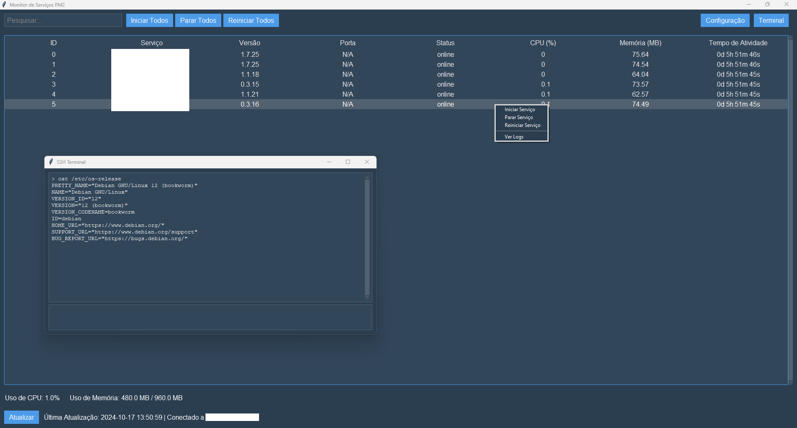

# GUI PM2 Monitor

## Description

**GUI PM2 Monitor** is a Python-based graphical application designed to simplify the monitoring and management of PM2 services running on a remote server. PM2 is a popular process manager for Node.js applications, but managing it via the command line on servers without a GUI can be cumbersome. This tool provides a user-friendly interface to interact with PM2 services, making it easier to:

- View the status of PM2 services.
- Start, stop, and restart services individually or collectively.
- Monitor server resources like CPU and memory usage.
- Access service logs directly from the GUI.

## Features

- **Service Management**: Start, stop, and restart individual services or all services at once.
- **Live Resource Monitoring**: View real-time CPU and memory usage of the remote server.
- **Service Details**: See detailed information about each service, including ID, name, status, CPU and memory usage, uptime, and log paths.
- **Log Access**: View stdout and stderr logs for each service within the application.
- **Search and Filter**: Easily search for services by name.
- **Terminal**: Open a terminal window to execute commands on the server directly from the GUI.
- **Sorting**: Sort services by any column, such as ID, name, status, CPU usage, etc.
- **Auto-Refresh**: Automatically refresh service status at a user-defined interval.
- **Internationalization (i18n)**: Supports multiple languages with easy translation setup.
- **Customizable Themes**: Choose from various themes using `ttkbootstrap` for a personalized look and feel.

## Requirements

- **Python 3.x**
- **Python Libraries**:
  - `paramiko`
  - `ttkbootstrap`
  - `tkinter` (usually included with Python)
- **Remote Server**:
  - PM2 installed
  - Required commands available: `pm2`, `mpstat`, `free`, `top`, `awk`, `grep`, `tail`

## Installation

1. **Clone the Repository**

   ```bash
   git clone https://github.com/devAlphaSystem/gui-pm2-monitor.git
   cd gui-pm2-monitor
   ```

2. **Install Dependencies**

   ```bash
   pip install -r requirements.txt
   ```

   _Ensure `paramiko` and `ttkbootstrap` are installed._

3. **Set Up Translations**

   - Make sure the `translations` directory exists.
   - Include necessary translation JSON files (e.g., `en.json` for English).

4. **Run the Application**

   ```bash
   python main.py
   ```

## Images



## Usage

### Initial Configuration

- **Server Details**: On the first run, you'll be prompted to enter your server's SSH details:
  - **Host**: The IP address or domain name of your server.
  - **Port**: SSH port (default is 22).
  - **Username**: Your SSH username.
  - **Password**: Your SSH password.
- **Preferences**: Set your auto-refresh interval and choose a theme.

### Main Interface

- **Service List**: Displays all PM2 services with details like ID, name, version, status, CPU and memory usage, uptime, and log paths.
- **Search Bar**: Filter services by name.
- **Sorting**: Click on column headers to sort the services.

### Managing Services

- **Select Services**: Click on a service to select it (use `Ctrl` or `Shift` to select multiple).
- **Control Buttons**:
  - **Start Service**: Start the selected service(s).
  - **Stop Service**: Stop the selected service(s).
  - **Restart Service**: Restart the selected service(s).
  - **View Logs**: Open a window to view stdout and stderr logs of the selected service.
  - **Start All**: Start all services.
  - **Stop All**: Stop all services.
  - **Restart All**: Restart all services.

### System Resources

- **CPU Usage**: Displays the current CPU usage percentage of the server.
- **Memory Usage**: Shows the used and total memory in MB.

### Configuration

- **Accessing Configurations**: Click the **Config** button to open the configuration window.
- **Changing Settings**: Update server details, auto-refresh interval, and theme.
- **Saving Changes**: Click **Save** to apply changes.

### Exiting the Application

- **Safe Exit**: Close the application using the window's close button. You'll be prompted to confirm the exit.

## Internationalization

- **Supported Languages**: English (`en`), Portuguese (`pt_br`), Spanish (`es`), French (`fr`), German (`de`).
- **Adding Translations**:
  - Add a JSON file to the `translations` directory named after the language code (e.g., `it.json` for Italian).
  - The application auto-detects the system language and loads the corresponding translations.

## Themes

- **Available Themes**: `superhero`, `cyborg`, `darkly`, `flatly`, `journal`, `lumen`, `minty`, `pulse`, `sandstone`, `solar`, `united`, `yeti`.
- **Changing Themes**:
  - Open the configuration window.
  - Select a theme from the dropdown menu.
  - Save changes to apply the new theme.

## Configuration Files

- **Location**:
  - **Windows**: `%APPDATA%\GUI_PM2_Monitor\config.json`
  - **macOS**: `~/Library/Application Support/GUI_PM2_Monitor/config.json`
  - **Linux**: `~/.config/GUI_PM2_Monitor/config.json`
- **Contents**: Stores server details and user preferences.

## Troubleshooting

- **Missing Translations**: Ensure that the `translations` directory contains an `en.json` file.
- **SSH Connection Issues**:
  - Double-check your server details in the configuration.
  - Ensure the server is reachable and SSH is enabled.
- **Missing Commands on Server**:
  - The application checks for required commands on the server.
  - Install any missing commands to ensure full functionality.

## Security and Antivirus

Note: Some users may encounter antivirus warnings when running the GUI PM2 Monitor executable. This is a false positive and does not indicate any malicious behavior. Below, we provide explanations and steps to address these concerns.

Why This Happens

- Packaging with PyInstaller: The application is packaged using PyInstaller, a tool that bundles Python scripts into standalone executables. While PyInstaller is widely used for legitimate purposes, some antivirus software may flag PyInstaller-packaged executables due to the way they bundle dependencies and the executable structure, which can resemble patterns used by malware.

- Heuristic Detection: Antivirus programs like Windows Defender use heuristic analysis to identify potential threats based on behavior and code patterns. Features in GUI PM2 Monitor such as SSH connections, process management, and log handling might inadvertently trigger these heuristics.

## Run from Source

Since the repository is public, you can run the application directly from the source code, which may reduce the likelihood of antivirus flags associated with executables:

Clone the Repository:

    git clone https://github.com/devAlphaSystem/gui-pm2-monitor.git
    cd gui-pm2-monitor

Install Dependencies:

    pip install -r requirements.txt

Run the Application:

    python main.py

## You can also package the application yourself using PyInstaller:

Install PyInstaller:

    pip install pyinstaller

Create the Executable:

    pyinstaller --onefile main.py

## Contributing

Contributions are welcome! If you have ideas for improvements or have found bugs, feel free to:

- **Fork the Repository**: Make changes and submit a pull request.
- **Open Issues**: Report bugs or request features via GitHub Issues.

---

_I created this project to simplify my workflow when managing PM2 services on servers without a GUI. Connecting via SSH and using terminal commands was not the most practical solution for me, so I developed this GUI application to make my life easier. I decided to make it public in case it helps others facing the same challenges._
